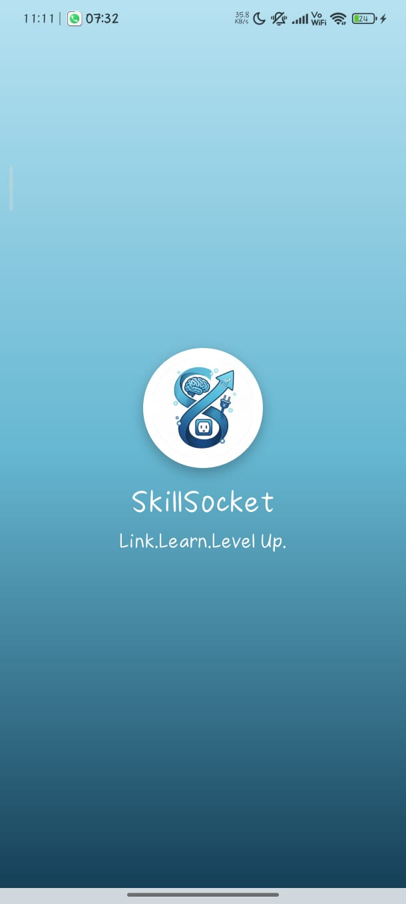
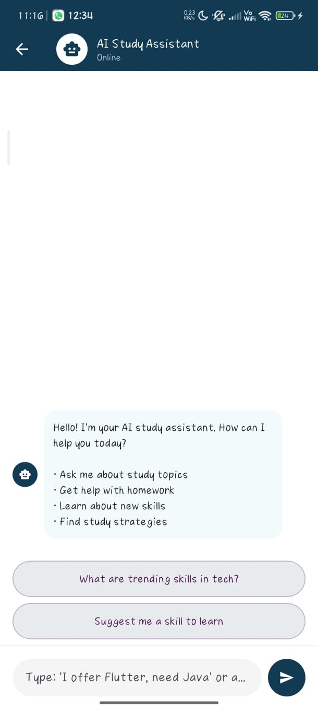
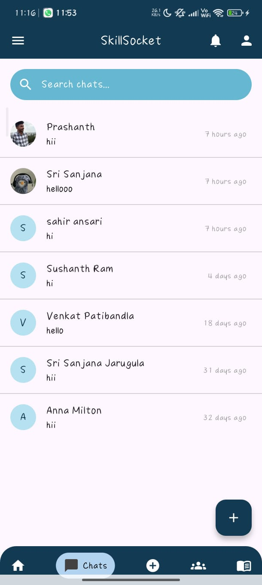
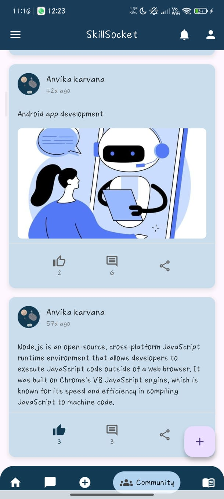
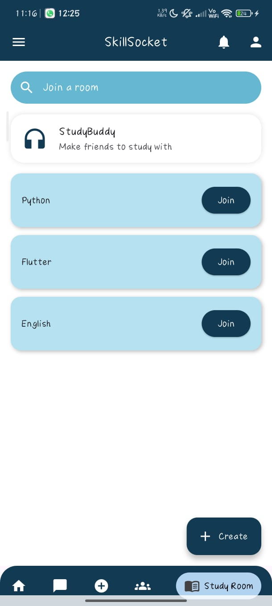
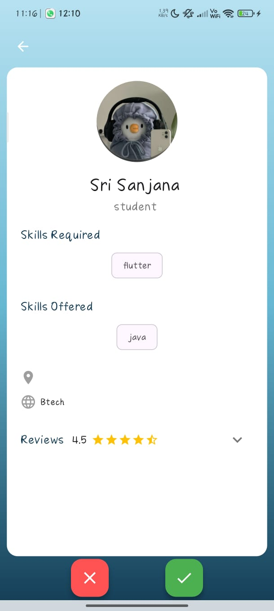

# SkillSocket  
<div style="display: flex; align-items: center;"> 
   
</div>  

---

##  Table of Contents  
- [Abstract](#abstract)  
- [Requirements](#requirements)  
- [How to Use](#how-to-use)  
- [Preview](#preview)  
- [Team Details](#team-details)  
- [Contribution](#contribution)  
- [Improvements](#improvements)  

---

##  Abstract  

**SkillSocket** is an interactive platform designed to enable users to **exchange skills, connect, and collaborate in real time**. It connects learners and mentors across diverse domains such as coding, design, art, and communication. The platform features **collaboration rooms**, a **Tinder-like matching interface** for connecting users with similar interests, **community spaces** for discussions, and **real-time chat** supported by an **AI chatbot** for instant assistance. By fostering collaboration and meaningful connections, SkillSocket aims to make learning more **accessible, engaging, and community-driven**.

---

## Requirements

### Frontend

| Package / Library           | Version       |
|-----------------------------|--------------------------|
| Flutter                     | [3.0.0 or above](https://flutter.dev/) |
| Dart                        | [>=3.0.0 <4.0.0](https://dart.dev/) |
| cupertino_icons             | [^1.0.2](https://pub.dev/packages/cupertino_icons) |
| http                        | [^1.0.0](https://pub.dev/packages/http) |
| shared_preferences          | [^2.0.0](https://pub.dev/packages/shared_preferences) |
| socket_io_client            | [^2.0.3+1](https://pub.dev/packages/socket_io_client) |
| swipable_stack              | [^2.0.0](https://pub.dev/packages/swipable_stack) |
| firebase_core               | [^2.15.0](https://pub.dev/packages/firebase_core) |
| firebase_messaging          | [^14.6.5](https://pub.dev/packages/firebase_messaging) |

### Backend

| Package / Library           | Version       |
|-----------------------------|--------------------------|
| Node.js                     | [>=18.0.0](https://nodejs.org/) |
| npm                         | [>=9.0.0](https://www.npmjs.com/) |
| MongoDB                     | [6.0 or above](https://www.mongodb.com/) |
| express                     | [^4.18.2](https://www.npmjs.com/package/express) |
| socket.io                   | [^4.7.2](https://www.npmjs.com/package/socket.io) |
| mongoose                    | [^7.3.1](https://www.npmjs.com/package/mongoose) |

### Deployment / DevOps

| Tool / Platform             | Version       |
|-----------------------------|--------------------------|
| Docker                      | [Latest stable](https://www.docker.com/) |
| Render                      | [Cloud deployment](https://render.com/) |

---

## How to Use  
Follow these steps to run the project:  

1.Clone the Repository:  
```terminal
git clone https://github.com/AAC-Open-Source-Pool/25AACR02.git
```
2.Navigate to the folder:
```terminal
cd 25AACR02
```
3.Install flutter dependencies:
```terminal
flutter pub get
```
4.Launch the App:
```terminal
flutter run
```

---

## Preview 
<div style="display: flex; align-items: center;"> 
 
 
 
 
 
 
 
</div>

---

## Team Details  
<b>Team Number:</b>  
25AACR02    

<b>Senior Mentor:</b>  
Vitesh   

<b>Junior Mentor:</b>  
Prajith   

<b>Team Member 1:</b>  
K. Anvika  

<b>Team Member 2:</b>  
Nakirekanti Prashanth

<b>Team Member 3:</b>  
Jarugula Sri Sanjana

<b>Team Member 4:</b>  
Ghulam Sahir Ansari

---

## Contribution
**This section provides instructions and details on how to submit a contribution via a pull request. It is important to follow these guidelines to make sure your pull request is accepted.**
1. Before choosing to propose changes to this project, it is advisable to go through the readme.md file of the project to get the philosophy and the motive that went behind this project. The pull request should align with the philosophy and the motive of the original poster of this project.
2. To add your changes, make sure that the programming language in which you are proposing the changes should be the same as the programming language that has been used in the project. The versions of the programming language and the libraries(if any) used should also match with the original code.
3. Write a documentation on the changes that you are proposing. The documentation should include the problems you have noticed in the code(if any), the changes you would like to propose, the reason for these changes, and sample test cases. Remember that the topics in the documentation are strictly not limited to the topics aforementioned, but are just an inclusion.
4. Submit a pull request via [Git etiquettes](https://gist.github.com/mikepea/863f63d6e37281e329f8) 

---

## Improvements
- Add **video calling** for live collaboration
- Integrate **AI skill-matching** for better user pairing
- Add **points and badges** to gamify learning
- Enable **offline material sharing** via Bluetooth or Wi-Fi Direct
- **Calendar integration** for scheduling sessions
